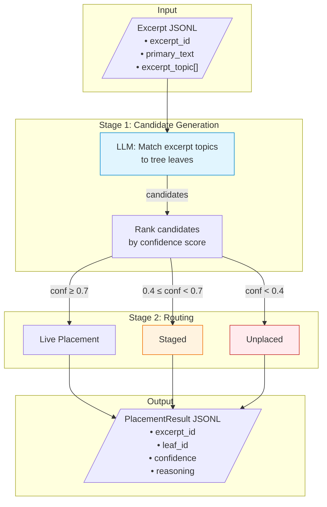

# NEXT: Create Engine Architecture Diagrams

## Goal

Create Mermaid diagrams that visually explain each engine's architecture. These diagrams are the owner's primary way of understanding how engines work — he does not read code. They must be accurate, detailed, and kept in sync with the codebase.

## What to create

Create the folder `docs/diagrams/` and populate it with:

1. **`pipeline_overview.mermaid`** — Full pipeline flow: source → normalization → passaging → atomization → excerpting → taxonomy → synthesis. Show what data format flows between each (e.g., "frozen HTML" → "NormalizedBook JSON" → etc.). Show which engines are built vs not-yet-built.

2. **One diagram per engine** (7 files):
   - `source.mermaid`
   - `normalization.mermaid`
   - `passaging.mermaid`
   - `atomization.mermaid`
   - `excerpting.mermaid`
   - `taxonomy.mermaid`
   - `synthesis.mermaid`

3. **`README.md`** in `docs/diagrams/` — index linking to each diagram with a one-line description.

## What each engine diagram must show

Read the engine's `SPEC.md` AND `src/` code to produce each diagram. The diagram must reflect the **actual implementation**, not just the SPEC's prose. Include:

- **Processing stages** in order (e.g., for normalization: HTML intake → structure discovery → layer detection → content census → normalization → validation → output)
- **Data models** — the key Pydantic models and what they carry (show 3-5 most important fields, not all)
- **Decision points** — where the engine branches (e.g., "is this a multi-layer book?" → yes/no paths)
- **Error/rejection paths** — where data gets rejected or flagged, with error codes
- **Input contract** — what the engine receives (format, required fields)
- **Output contract** — what the engine produces (format, key fields)
- **LLM calls** — if the engine uses LLM, show where and what the call does (e.g., "LLM: classify excerpt topic")

Use `flowchart TD` (top-down) as the default Mermaid diagram type. Use subgraphs to group related stages. Use colors/styles to distinguish: normal flow (default), error paths (red/dashed), LLM calls (a distinct style), and data models (a distinct shape).

## Style reference

Here is an example of the level of detail and style expected. This is a SIMPLIFIED excerpt — your real diagrams should be MORE detailed based on what you find in the SPEC and code:

Your diagrams should be significantly more detailed than this example — this is just to show the formatting style.

## How to build each diagram

For each engine:
1. Read `engines/{name}/SPEC.md` completely
2. Read every file in `engines/{name}/src/`
3. Trace the main processing flow through the code
4. Identify all branch points, error paths, and LLM calls
5. Write the Mermaid diagram
6. Verify the diagram matches the code (e.g., if the code has 5 stages, the diagram must have 5 stages — not 3)

## Commit

Commit all files in a single commit with message: `docs: add engine architecture diagrams`

Push to main.

## STOP

Do NOT implement anything beyond what is specified here. After completing the diagrams, commit, push, and stop. Do NOT modify any engine code, SPECs, or tests.
