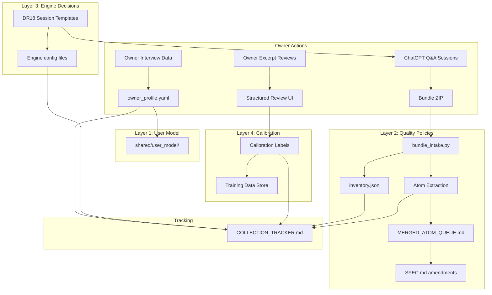

# feat: Design and build feedback collection system for July 1 readiness

## Overview

Design and implement the workflow, data formats, session templates, and automation to collect all 42 owner-dependent pipeline decisions before July 1, 2026. The system uses the established ChatGPT bundle format as its backbone, adds intake automation scripts, formalizes the user model artifact, and creates structured questionnaire templates for each collection layer.

This plan does NOT implement the structured review UI (Layer 4 calibration interface) — that is a separate implementation session. This plan designs the collection workflow, data formats, and session infrastructure.

## Problem Frame

The KR pipeline has 5 engines needing ~42 owner-dependent decisions that cannot be derived from code, text analysis, or LLM inference. A 5-coworker synthesis (see origin: `docs/brainstorms/2026-04-07-feedback-collection-strategy-requirements.md`) identified a 4-layer architecture:

1. **User Model + Pedagogical Mode** (~3h, weeks 1-2) — partially resolved
2. **Quality Policies + Conflict Governance** (~3h, weeks 2-4) — S-1 done, rest missing
3. **Engine Decisions + Parameters** (~5h, weeks 1-3) — mostly missing
4. **Calibration** (~20-30h, weeks 4-12 + summer) — requires real output

The owner has a strict fatigue profile: prefers structured/interactive feedback, tolerates 10-15 excerpts/session, and can sustain ~30 min/day average.

## Requirements Trace

- R1. Formalize user_model artifact from interview data
- R2. Record per-science study mode decisions (madhab, munazarah, shubuhat)
- R3. Maintain formal 19-science ranking
- R4. Record grammar school terminology preference (Basran default assumed)
- R5. Collect S-1 priority ranking — **DONE** (S-1 intake complete, 11 atoms in MAQ Section M)
- R6. Collect S-2 ideal/worst excerpt definition
- R7. Complete remaining questionnaire items (K, E, D, SC, GN, L series)
- R8. Define fiqh masking policy
- R9. Complete DR18's 5 focused sessions
- R10. Update TEAM_TRANSLATION_GUIDE.md for FP-13..22
- R11. Collect 100+ excerpt judgments for calibration
- R12. Collect 30-100 study-readiness labels (FP-18)
- R13. Complete 30-book owner review gate
- R14. Collect DEPENDENT disposition rubrics
- R15. All data persisted as training material with full provenance
- R16. Bundle format improvements for remaining bundles
- R17. Cross-engine drift auto-routed to correct engine

## Scope Boundaries

**In scope:**
- Collection workflow design and session templates
- Data format standardization (manifest schema, JSONL patterns)
- Intake automation scripts (inventory, extraction, integration)
- User model artifact formalization from existing interview data
- Questionnaire templates for remaining Layer 2+3 items
- Progress dashboard/tracker
- Collection calendar with milestone gates

**Not in scope:**
- Building NEW review UI for calibration — `tools/review.py` already has questionnaire + review + comparison modes. Extending it is in scope; replacing it is not.
- Running the excerpting pipeline or processing books
- Taxonomy engine work, synthesis engine work
- Spaced repetition algorithm implementation
- The 30-book probe itself (requires hardened pipeline output)

## Context & Research

### Relevant Code and Patterns

**Established bundle format (9 bundles processed):**
- `engines/excerpting/chatgpt_s1_collection/` — latest, most refined format (S-1 intake just completed)
- `engines/excerpting/chatgpt_d1_collection_bundle/` — earliest format, slightly nested
- Pattern: `00_manifest.yaml` + numbered analysis files (JSONL/YAML/MD) + `source_artifacts/` + `README.md`
- Each bundle has: manifest with provenance, owner raw reaction, engineering expansion, inventory.json

**Intake protocol (established in Session 5, refined in Session 11):**
1. Unzip → verify file count
2. Create `inventory.json` (file list, record counts, source basis distribution)
3. Read manifest + owner raw reaction (Layer A ground truth)
4. Read all analysis files
5. Extract atoms (with MAQ-ID assignment)
6. Integrate into `MERGED_ATOM_QUEUE.md` as new section
7. Archive ZIP to `source_artifacts/`
8. Validate: JSONL parseable, YAML parseable, all traceability records route

**User model SPEC:** `shared/user_model/SPEC.md` (368 lines, Cycle 0, not yet implemented). Defines engagement tracking, knowledge state estimation, scholarly profile, gap analysis. Collection system populates data that flows into this component.

**Coworker dispatch:** `.kr/runtime/dispatch_log.jsonl` — JSONL with timestamp, coworker, phase, task, result. Every major conclusion requires multi-source validation.

**5-coworker synthesis:** `engines/excerpting/reference/dr_reviews/FINAL_SYNTHESIS_5_OF_5.md` — the architectural blueprint. 4-layer model, phased collection roadmap, calendar, corrections applied.

**EXISTING QUESTIONNAIRE INFRASTRUCTURE (critical — discovered by research agents):**
- `integration_tests/questionnaire/interactions.json` — 40 structured interactions already defined (0/38 answered)
- `integration_tests/questionnaire/questionnaire_responses.jsonl` — JSONL response storage
- `integration_tests/questionnaire/RESPONSE_FORMAT.md` — response schema (standard + edge case)
- `integration_tests/questionnaire/OWNER_FEEDBACK_GUARDRAIL.md` — owner answers are signal, not authority
- `integration_tests/questionnaire/TEAM_TRANSLATION_GUIDE.md` — interaction-to-SPEC dimension mapping
- `tools/review.py` — local HTTP server (port 8384) with questionnaire + review + comparison modes
- 5 scripts: `validate_questionnaire_packet.py`, `summarize_questionnaire_responses.py`, `audit_questionnaire_responses.py`, `generate_questionnaire_review_packets.py`, `build_questionnaire_dr_bundle.py`
- This infrastructure is mature and should be EXTENDED, not replaced. Layer 2 collection should use this existing system for the excerpting questionnaire items.

### Institutional Learnings

- **Owner fatigue:** Open-ended questions exhaust (1h each). Structured/interactive preferred. 10-15 excerpts/session. Budget: ≤30 min/day.
- **Bundle format improvements needed (ChatGPT DR audit):** 4 additions for future bundles: (1) standardized manifest schema with `bundle_type` discriminator, (2) `final_decisions.jsonl` for machine-readable resolved choices, (3) `integrity_manifest.json` with SHA-256 per file, (4) standardized `authority_level` tagging.
- **Bundle format lessons:** D1/D2 bundles had nested directory issue (fixed in G-series flattening, Session 5). S-1 format is the gold standard.
- **Owner answers need guardrail pipeline:** Raw answer → evaluated interpretation → coworker challenge → bounded rule. See `integration_tests/questionnaire/OWNER_FEEDBACK_GUARDRAIL.md`.
- **Feasibility tagging required:** ChatGPT DR produced a feasibility matrix (ALREADY_DONE / EASY / HARD / INFEASIBLE). Questions classified as INFEASIBLE for a given engine must be deferred, not collected prematurely.
- **Per-science collection tracks:** Gemini DR recommends science-specific tracks (April: imla+sarf, May: nahw+balagha, June: fiqh+mantiq). Uniform questionnaire produces misleading data for non-fiqh sciences.
- **Weekly cycle alignment:** Owner hits CC limit by Wednesday, resets Monday. Collection sessions Thu-Sun; CC prepares materials Mon-Wed.
- **Phantom constraint incident:** Numbers appearing in documents get treated as hard constraints without validation. All numeric thresholds need CONSTRAINT_REGISTRY.md entries.
- **Single-model conclusions:** Every content quality conclusion needs 2+ independent evaluators. Owner answers are signal, not directives — must be challenged by coworkers.
- **139 files are golden data:** F-collection directories contain 139 files of structured owner feedback. All must be read, not sampled.

## Key Technical Decisions

- **Bundle format: Continue S-1 pattern** — The S-1 format (manifest.yaml + numbered analysis files + source_artifacts + README) is the most refined and well-tested. All future bundles follow this structure. Rationale: 9 bundles already processed, intake scripts exist, atom extraction is proven.

- **Storage: Per-engine collection directories** — Each bundle stored at `engines/<engine>/chatgpt_<series>_collection/`. Cross-engine data routed by the intake process. Rationale: Keeps data close to the engine that consumes it; matches existing convention.

- **Questionnaire workflow: Existing ChatGPT session workflow** — Owner continues using ChatGPT for deep questions (K, E, D, GN, L series). ChatGPT produces ZIP bundles. CC intakes them. Rationale: Owner is comfortable with this workflow; it produces the richest structured output; no workflow disruption.

- **User model formalization: YAML artifact, not code** — Layer 1 decisions formalized as `shared/user_model/owner_profile.yaml` — a structured data file, not code implementation. Rationale: The user_model SPEC (Cycle 0) isn't built yet; the YAML artifact is the data that will seed it when implemented.

- **Intake automation: Python scripts** — `scripts/bundle_intake.py` orchestrates: unzip → inventory → validate → extract atoms → integrate → archive. Rationale: Python is the project language; scripts already exist for individual steps (compiled .pyc files found).

- **Progress tracking: COLLECTION_TRACKER.md** — Markdown checklist at `engines/excerpting/reference/COLLECTION_TRACKER.md` tracking all 42 decisions. Rationale: Git-native, reviewable, no external tooling needed.

- **Basran default assumed** — Per Gemini DR recommendation. Owner confirmation collected in Phase A question 2. If owner chooses "both", a Kufan synonym-mapping layer is added. This does not change the collection system design.

## Open Questions

### Resolved During Planning

- **S-1 status:** DONE — 11 governance atoms integrated into MAQ Section M (Session 11 intake)
- **Bundle format for remaining questions:** Continue S-1 format, no changes needed
- **Basran-only or both:** Assumed Basran default per Gemini DR; deferred to Phase A collection

### Deferred to Implementation

- **Fiqh masking integration:** How does the masking layer integrate with Phase 2b grouping? Needs excerpting contract analysis during implementation.
- **Retroactive bundle format upgrade:** Should F1-F8/G1-G4/SC1 bundles be reformatted? Cost-benefit analysis during implementation.
- **Structured review UI design:** Layer 4 calibration interface is a separate implementation session.
- **DEPENDENT disposition rubrics:** What exactly constitutes a rubric entry? Clarified during Layer 4 calibration when real output is available.

## High-Level Technical Design

> *This illustrates the intended approach and is directional guidance for review, not implementation specification. The implementing agent should treat it as context, not code to reproduce.*

## Implementation Units

- [ ] **Unit 1: Bundle intake automation script**

**Goal:** Replace the manual intake process (currently done by CC inline, as just demonstrated with S-1) with a repeatable Python script that handles unzip → inventory → validate → report.

**Requirements:** R15 (provenance), R16 (bundle format)

**Dependencies:** None — foundational

**Files:**
- Create: `scripts/bundle_intake.py`
- Create: `scripts/bundle_schema.py` (manifest schema validation)
- Test: `tests/test_bundle_intake.py`

**Approach:**
- Accept a ZIP path and target engine as arguments
- Unzip to `engines/<engine>/chatgpt_<series>_collection/`
- Validate: manifest.yaml parseable, all JSONL valid, source_artifacts present, file count matches manifest
- Generate `inventory.json` with file list, record counts, source basis distribution
- Report: success/failure with validation details
- Do NOT extract atoms (that remains CC's job — requires semantic understanding)

**Patterns to follow:**
- `engines/excerpting/chatgpt_s1_collection/inventory.json` — the inventory format just created
- `engines/excerpting/chatgpt_s1_collection/00_manifest.yaml` — the manifest format

**Test scenarios:**
- Happy path: valid S-1 bundle ZIP → inventory.json created, all validations pass
- Edge case: ZIP with nested directory structure (D1 pattern) → correctly handles nesting
- Error path: invalid JSONL in bundle → reports which file and line failed
- Error path: missing manifest.yaml → clear error with remediation hint
- Edge case: ZIP with extra unexpected files → inventory includes them, warns

**Verification:**
- `python scripts/bundle_intake.py chatgpt_s1_collection_bundle.zip --engine excerpting` processes successfully
- Generated inventory.json matches the one created during S-1 manual intake

---

- [ ] **Unit 2: User model artifact formalization (Layer 1)**

**Goal:** Create the formal `owner_profile.yaml` artifact from existing interview data, capturing all Layer 1 decisions already collected plus placeholders for remaining items.

**Requirements:** R1, R2, R3, R4

**Dependencies:** None — uses existing interview data

**Files:**
- Create: `shared/user_model/owner_profile.yaml`
- Create: `shared/user_model/science_ranking.yaml`
- Modify: `shared/user_model/CLAUDE.md` (note artifact existence)

**Approach:**
- Extract from NEXT.md interview data: Arabic-first priority, Hanbali primary madhab, beginner level, memorization-first posture, fiqh masking, mantiq as science #19
- Structure as YAML with sections: study_mode, science_priorities, madhab_config, terminology_preferences, fatigue_profile, session_tolerance
- Each field tagged with: `source` (interview/owner_answer/assumed), `date`, `confidence`, `decision_id` (mapping to DR18 decision codes)
- Mark unresolved items as `status: PENDING` with the question to ask

**Patterns to follow:**
- `engines/excerpting/chatgpt_s1_collection/05_priority_ranking_matrix.yaml` — structured YAML with provenance

**Test scenarios:**
- Happy path: YAML parseable, all required fields present, science count = 19
- Edge case: PENDING items have both the question text and the coworker recommendation
- Integration: science_ranking.yaml cross-references library/sciences/ tree structure

**Verification:**
- `python -c "import yaml; yaml.safe_load(open('shared/user_model/owner_profile.yaml'))"` succeeds
- All 19 sciences listed with priority order
- All 4 owner curriculum questions from synthesis included with current status

---

- [ ] **Unit 3: Questionnaire integration + ChatGPT session templates (Layer 2)**

**Goal:** Connect the existing questionnaire infrastructure (`integration_tests/questionnaire/`, 40 interactions, review server) to the collection workflow, and create ChatGPT session templates for the deep-dive items that need the richer S-1 bundle format.

**Requirements:** R6, R7

**Dependencies:** Unit 1 (bundle schema for validation)

**Files:**
- Modify: `integration_tests/questionnaire/TEAM_TRANSLATION_GUIDE.md` (add FP-13..22 mappings per R10)
- Create: `engines/excerpting/reference/questionnaire_templates/S-2_template.md`
- Create: `engines/excerpting/reference/questionnaire_templates/K-series_template.md`
- Create: `engines/excerpting/reference/questionnaire_templates/E-series_template.md`
- Create: `engines/excerpting/reference/questionnaire_templates/D-series_template.md`
- Create: `engines/excerpting/reference/questionnaire_templates/supplementary_template.md` (SC2/3, GN1/2, L1/2)
- Create: `engines/excerpting/reference/questionnaire_templates/README.md`

**Approach:**
- **Two collection channels:** (1) Existing questionnaire system (40 interactions, review server at port 8384) for structured feedback on concrete excerpts. (2) ChatGPT S-1-format bundles for deep governance/policy questions that need rich analysis.
- The existing questionnaire handles most Layer 2 items that involve reacting to excerpts. ChatGPT templates handle the deep-dive items (K-series khilaf, E-series evidence, D-series definitions) that require extended scholarly analysis.
- Templates tailored per domain: K-series requires hadith/evidence examples, E-series requires Arabic evidence text, D-series requires definition splitting examples
- All ChatGPT templates pass through `/prompt-architect` before use
- Each question tagged with feasibility class (ALREADY_DONE / EASY / HARD / INFEASIBLE) from ChatGPT DR matrix
- Update TEAM_TRANSLATION_GUIDE.md to map FP-13..22 (currently zero mappings for the hardened FP layer)

**Patterns to follow:**
- `engines/excerpting/chatgpt_s1_collection/source_artifacts/s1_full_user_input_2026_04_07.txt` — the S-1 prompt is the gold standard for ChatGPT templates
- `integration_tests/questionnaire/interactions.json` — the existing interaction format for questionnaire items
- `integration_tests/questionnaire/OWNER_FEEDBACK_GUARDRAIL.md` — guardrail pipeline for processing answers

**Test scenarios:**
- Happy path: each ChatGPT template, when used, produces a valid bundle (verified by Unit 1 intake)
- Happy path: TEAM_TRANSLATION_GUIDE maps all 40 interactions + FP-13..22
- Edge case: K-series template handles hadith with isnad chains (Arabic text preservation)
- Edge case: D-series template handles definition-splitting with real Arabic terms
- Integration: questionnaire response from review server can be cross-referenced with ChatGPT bundle atoms

**Verification:**
- Each ChatGPT template has the complete file creation requirements list
- TEAM_TRANSLATION_GUIDE.md covers all 40 interactions including FP-13..22
- README.md maps each questionnaire ID to its collection channel (questionnaire vs ChatGPT) and current status

---

- [ ] **Unit 4: DR18 engine decision session framework (Layer 3)**

**Goal:** Create session templates for DR18's 5 focused owner sessions, each collecting specific engine configuration parameters.

**Requirements:** R9, R10

**Dependencies:** Unit 2 (user model artifact provides context for sessions)

**Files:**
- Create: `engines/excerpting/reference/dr18_sessions/session_A_sciences.md`
- Create: `engines/excerpting/reference/dr18_sessions/session_B_trust.md`
- Create: `engines/excerpting/reference/dr18_sessions/session_C_books.md`
- Create: `engines/excerpting/reference/dr18_sessions/session_D_thresholds.md`
- Create: `engines/excerpting/reference/dr18_sessions/session_E_style.md`
- Create: `engines/excerpting/reference/dr18_sessions/README.md`

**Approach:**
- Each session template maps DR18 decision codes (SRC-D-001, EXC-D-010, etc.) to owner-facing questions
- Questions are structured/interactive: multiple choice, ranking, concrete examples
- Each session designed for ~60 min owner time (fits 2 days at 30 min/day)
- Outputs stored as engine-specific config files: `engines/<engine>/config/owner_decisions.yaml`
- Each session specifies which coworkers validate the results

**Patterns to follow:**
- DR18 decision map in `engines/excerpting/reference/dr_reviews/` (decision codes and descriptions)
- Owner interview pattern from NEXT.md (study-focused questions, not technical)

**Test scenarios:**
- Happy path: Session A template → 19-science ranking + per-science study mode decisions
- Happy path: Session B template → muhaqiq trust list + publisher reputation decisions
- Edge case: Session D includes numeric thresholds that must go through CONSTRAINT_REGISTRY.md
- Integration: Session outputs cross-reference user_model/owner_profile.yaml

**Verification:**
- Each session template maps to specific DR18 decision codes
- All 42 decision points are covered across 5 sessions + Layer 2 questionnaires
- Each session has explicit coworker validation requirements

---

- [ ] **Unit 5: Collection progress tracker**

**Goal:** Create a comprehensive progress tracker that shows status across all 4 layers, all 42 decisions, and the collection calendar.

**Requirements:** R5 (done), R6-R14 (tracking)

**Dependencies:** Units 2-4 (defines what to track)

**Files:**
- Create: `engines/excerpting/reference/COLLECTION_TRACKER.md`
- Modify: `NEXT.md` (add tracker reference to feedback collection workstream section)

**Approach:**
- Checklist format: each of 42 decisions listed with status (RESOLVED / PENDING / IN_PROGRESS / DEFERRED)
- Grouped by layer and phase (A/B/C/D per synthesis)
- Each item shows: decision code, owner-facing question summary, source coworker, current status, resolution date if done
- Calendar milestones: April checkpoint, May checkpoint, June checkpoint, July 1 gate
- Budget tracking: hours spent vs projected

**Patterns to follow:**
- `engines/excerpting/reference/FOUNDATIONS_HARDENING_LEDGER.md` — the hardening ledger pattern

**Test scenarios:**
- Test expectation: none — pure documentation artifact

**Verification:**
- All 42 DR18 decision points appear
- S-1 marked as RESOLVED with date 2026-04-07
- Layer 1 partially-resolved items from interview appear with correct status
- Calendar milestones align with Gemini DR's month-by-month schedule

---

- [ ] **Unit 6: Cross-engine data routing manifest**

**Goal:** Define how owner answers that affect multiple engines get routed to each engine's data store.

**Requirements:** R17

**Dependencies:** Units 2-4 (defines the data being routed)

**Files:**
- Create: `shared/validation/decision_routing.yaml`
- Create: `shared/validation/README_routing.md`

**Approach:**
- YAML manifest mapping each decision ID to: primary engine, secondary engines, affected files, FP references
- Example: S-1 priority ranking → primary: excerpting (SPEC §1.1b), secondary: taxonomy (priority order), synthesis (quality governance)
- Intake automation (Unit 1) reads this manifest to warn when a bundle's atoms affect engines beyond the primary
- Cross-engine atoms flagged for explicit routing during intake

**Patterns to follow:**
- `engines/excerpting/reference/DEDUP_RECONCILIATION_SESSION10.md` — cross-reference pattern

**Test scenarios:**
- Happy path: S-1's 11 atoms → routing manifest correctly identifies excerpting as primary, flags 2 atoms for taxonomy routing
- Edge case: K-series atoms (khilaf/tarjih) affect both excerpting and taxonomy
- Error path: decision ID not in routing manifest → warning during intake

**Verification:**
- Every decision from DR18's 42-point map has a routing entry
- No cross-engine atom can be processed without routing manifest lookup

---

- [ ] **Unit 7: Layer 4 calibration infrastructure specification**

**Goal:** Specify (but not implement) the calibration data collection pipeline: what data to collect, in what format, and how it feeds back into the pipeline. This unit produces a specification, not code.

**Requirements:** R11, R12, R13, R14

**Dependencies:** Units 1-5 (Layer 1-3 infrastructure must exist)

**Files:**
- Create: `engines/excerpting/reference/calibration_spec.md`

**Approach:**
- Define the calibration data schema: excerpt ID, owner judgment (teaching unit quality rating 1-5), study-readiness label (FULL → acceptable/study-ready split), free-text reaction, timestamp
- Define the structured review session format: 10-15 excerpts per session, each with side-by-side source view, multiple-choice judgment options, optional free-text
- Define the 30-book probe protocol: book selection criteria, review order, pass/fail criteria
- Define how calibration data feeds back: FP-18 threshold calibration, quality metric validation, error pattern detection
- Specify provenance requirements: every judgment tagged with model version of excerpt, prompt version, owner session ID

**Test scenarios:**
- Test expectation: none — specification document, not code

**Verification:**
- Calibration schema covers all 4 calibration requirements (R11-R14)
- Schema includes all provenance fields per R15
- Session format respects owner fatigue profile (10-15 per session, structured/interactive)
- 30-book probe criteria defined with clear pass/fail thresholds

## System-Wide Impact

- **Interaction graph:** Bundle intake affects MERGED_ATOM_QUEUE.md → SPEC amendments → prompt changes → test updates. Each bundle triggers the full hardening lifecycle (§4 of hardening protocol).
- **Error propagation:** Bundle validation failures halt intake — no partial imports. Owner raw reactions always preserved regardless of validation outcome.
- **State lifecycle risks:** Concurrent Codex and CC sessions could both process bundles. Mitigation: git-native conflict detection; each bundle has a unique series ID.
- **API surface parity:** None — no API changes. This is workflow infrastructure.
- **Integration coverage:** Cross-engine routing (Unit 6) is the main integration seam. Verified by checking that every decision ID has a routing entry.
- **Unchanged invariants:** The excerpting engine's SPEC, contracts, and test suite are NOT changed by this plan. Collection produces data that informs future SPEC amendments through the existing hardening protocol.

## Risks & Dependencies

| Risk | Likelihood | Impact | Mitigation |
|------|-----------|--------|------------|
| Owner fatigue causes incomplete collection | Medium | High | Structured/interactive format, 30 min/day cap, calendar milestones, progress visibility |
| ChatGPT bundle format drift (inconsistent output) | Low | Medium | Manifest schema validation (Unit 1), template standardization (Unit 3) |
| Cross-engine routing errors | Low | High | Routing manifest (Unit 6) with explicit validation during intake |
| Layer 4 blocked by pipeline not ready | High | Medium | Accepted — Layer 4 is summer work, pipeline hardening continues in parallel |
| Codex reorganization deletes files | Medium | Medium | Git-native recovery (as demonstrated in this session), branch protection |

## Phased Delivery

### Phase 1: Foundation (Week 1) — Units 1, 2, 5
Bundle intake automation, user model artifact, progress tracker. These enable all subsequent collection.

### Phase 2: Questionnaire Infrastructure (Weeks 1-2) — Units 3, 4
Session templates for Layer 2 and Layer 3. Owner can begin using templates immediately after review.

### Phase 3: Integration (Week 2-3) — Unit 6
Cross-engine routing. Enables correct data flow as bundles start arriving.

### Phase 4: Calibration Specification (Week 3-4) — Unit 7
Layer 4 spec. Produces the blueprint for the summer calibration implementation session.

## Sources & References

- **Origin document:** [docs/brainstorms/2026-04-07-feedback-collection-strategy-requirements.md](docs/brainstorms/2026-04-07-feedback-collection-strategy-requirements.md)
- **5-coworker synthesis:** [engines/excerpting/reference/dr_reviews/FINAL_SYNTHESIS_5_OF_5.md](engines/excerpting/reference/dr_reviews/FINAL_SYNTHESIS_5_OF_5.md)
- **S-1 bundle (gold standard format):** [engines/excerpting/chatgpt_s1_collection/](engines/excerpting/chatgpt_s1_collection/)
- **DR18 decision map:** engines/excerpting/reference/dr_reviews/ (Claude DR report)
- **User model SPEC:** [shared/user_model/SPEC.md](shared/user_model/SPEC.md)
- **Hardening protocol:** [engines/excerpting/reference/HARDENING_SESSION_PROTOCOL.md](engines/excerpting/reference/HARDENING_SESSION_PROTOCOL.md)
