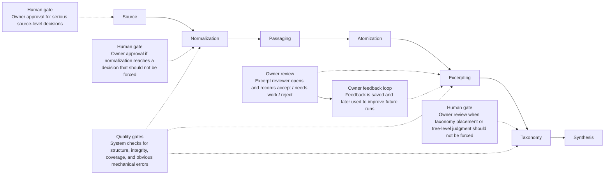

# Where The Owner Touches The System

This page does not show code or internal architecture. It shows the places where the owner matters in the life of one book.

## What these touchpoints mean

- `Human gates` are approval checkpoints. KR uses them when a decision is too important to auto-accept.
- `Owner review` is the practical touchpoint the owner is most likely to feel: the excerpt reviewer opens, the owner reacts to individual excerpts, and those reactions are saved.
- `Quality gates` are system-side review points. They are not owner decisions. They are the system checking whether structure, references, and outputs still make sense before moving on.

## The owner's most direct interaction

Today, the clearest owner-facing surface is excerpt review:

- KR opens the excerpt reviewer.
- The owner reads one excerpt at a time.
- The owner marks it as `accept`, `needs work`, or `reject`.
- KR saves that reaction as feedback for future improvement.

## A useful mental model

- The owner is not expected to debug the system.
- The owner is expected to react when KR asks, "Does this result make sense to you?"
- KR should use those reactions at the touchpoints above instead of making irreversible decisions silently.

## Where these touchpoints live in the repo

- Human gate records live under `library/gates/`.
- Owner excerpt feedback is written by the review tool into `owner_feedback.jsonl`.
- Quality checks are run by validation and evaluation tools before work is treated as trustworthy.
