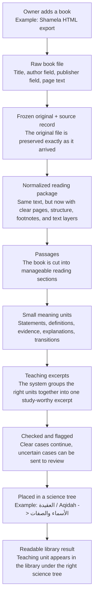

# How One Book Moves Through KR

This page follows one book from the moment the owner adds it to the moment it appears in the library under the right subject.

## What each step means in normal language

1. The owner adds a book, usually a source file exported from Shamela.
2. KR preserves the original file exactly, so nothing important is silently changed.
3. KR turns the raw format into a clean internal book package with pages, headings, footnotes, and text layers.
4. The book is broken into reading-sized parts.
5. Those parts are broken further into the smallest meaningful scholarly units.
6. KR groups the right units together into one teaching excerpt that can stand on its own.
7. If something is uncertain, KR can stop and ask for review instead of pretending it is sure.
8. The excerpt is placed into the right subject tree.
9. The library can then show that teaching unit in the right place, ready for later synthesis and study.

## Example journey

- `كتاب التوحيد / Kitab al-Tawhid` enters as an HTML file.
- KR preserves the file, reads its structure, and identifies its internal sections.
- A section about `القدر / Divine Decree` becomes passages, then smaller meaning units.
- KR turns those units into a teaching excerpt.
- That excerpt is placed under `العقيدة / Aqidah`.
- The owner eventually sees it in the library where it belongs.

## Important note

This page uses the owner-facing 7-stage journey. In the current implementation, some passaging and atomization work happens inside the excerpting engine, but the owner-facing flow is still the same journey shown above.
