# KR Pipeline Overview

This page is a plain-language map of how one book moves through KR, the personal scholarly library pipeline.

The main idea is simple: a raw book file enters, the system understands it step by step, and a readable teaching result comes out at the end.

```mermaid
flowchart LR
    source["1. Source<br/>محرك المصادر / Source Engine<br/><br/>In: a raw book file such as Shamela HTML, with book title and file details<br/>Does: freezes the original file, gives it an identity, and records basic metadata about the work<br/>Out: frozen original + source record + metadata"]
    normalization["2. Normalization<br/>محرك التطبيع / Normalization Engine<br/><br/>In: the frozen source file and its metadata<br/>Does: turns format-specific text into one clean internal shape while preserving pages, layers, and diacritics<br/>Out: normalized text package with structure, pages, footnotes, and text layers"]
    passaging["3. Passaging<br/>محرك التقطيع / Passaging Engine<br/><br/>In: normalized book text<br/>Does: breaks the book into manageable reading-sized passages without losing heading or page context<br/>Out: passage stream ready for closer analysis"]
    atomization["4. Atomization<br/>محرك التذرية / Atomization Engine<br/><br/>In: passages<br/>Does: breaks each passage into the smallest meaningful units and labels what kind of scholarly material each unit is<br/>Out: atom stream of small typed meaning units"]
    excerpting["5. Excerpting<br/>محرك الاقتطاف / Excerpting Engine<br/><br/>In: atoms and passage context<br/>Does: groups units into teaching excerpts, enriches them with metadata, and flags uncertain cases for review<br/>Out: excerpt records such as one clean teaching unit from كتاب التوحيد / Kitab al-Tawhid"]
    taxonomy["6. Taxonomy<br/>محرك التصنيف الشجري / Taxonomy Engine<br/><br/>In: excerpts<br/>Does: places each excerpt under the right science tree and the right leaf inside that science<br/>Out: placed excerpts inside trees such as العقيدة / Aqidah or النحو / Nahw"]
    synthesis["7. Synthesis<br/>محرك التركيب / Synthesis Engine<br/><br/>In: placed excerpts from one branch of a science tree<br/>Does: turns them into readable scholarly entries that the owner can study<br/>Out: a library entry or teaching unit in the right place"]

    source --> normalization --> passaging --> atomization --> excerpting --> taxonomy --> synthesis
```

## One concrete example

- A Shamela HTML file for `كتاب التوحيد` enters the Source engine.
- The system freezes the file so the original never changes.
- Normalization turns that file into structured text with pages, headings, and text layers.
- Passaging and Atomization turn that text into smaller study-ready pieces.
- Excerpting builds one teaching excerpt, for example a short unit about `الأسماء والصفات` with its page and source context still attached.
- Taxonomy places that excerpt under `العقيدة / Aqidah`.
- Synthesis later turns those placed excerpts into something the owner can actually read as knowledge.

## Important note

This diagram shows KR in the owner-facing 7-stage form. In the current codebase, some passaging and atomization logic is implemented inside the excerpting engine, but the conceptual journey for the owner is still the 7-step flow shown here.
