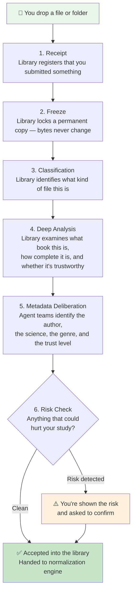
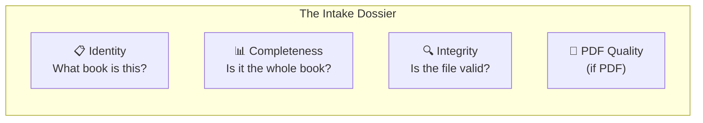
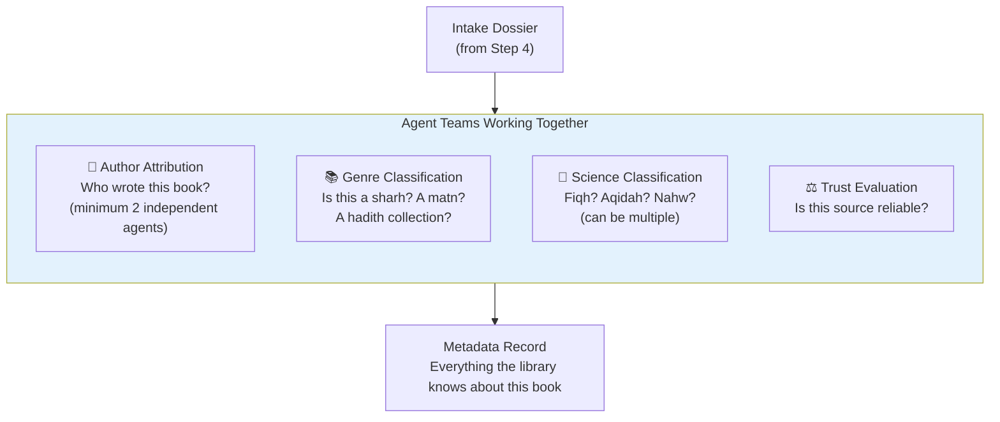
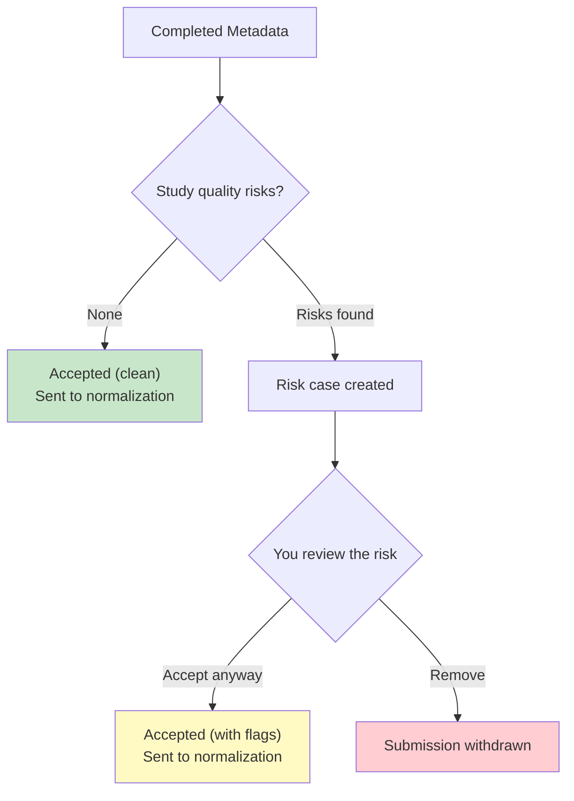
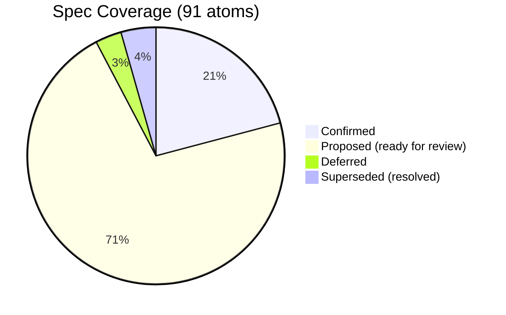

# What Happens When You Give the Library a Book

This document shows what the source engine does, in your language.
The source engine is the **front door** of your library. Every book passes through it first.

---

## The Journey — Overview

---

## Step by Step — What Happens at Each Stage

### Step 1: Receipt

**What happens:** You give the library a file path. The library creates a record: "Rayane submitted this file at this time."

**What you see:** Nothing. This is instant and silent.

**What the library does NOT do here:** It doesn't open the file, read the content, guess the author, or do any analysis. It just registers that something arrived.

**What could go wrong:**
- The file doesn't exist → the library tells you immediately
- The file is empty (0 bytes) → the library tells you immediately

**Owner hints:** If you *want* to say "I think this is by al-Nawawi" or "this is fiqh", you can. The library stores your hint separately. It will check your hint later — but it never *starts* from your hint. It always figures things out independently first, then compares.

---

### Step 2: Freeze

**What happens:** The library makes an exact copy of your file and locks it permanently. It computes a fingerprint (SHA-256 hash) so it can always verify: "this is exactly what Rayane gave me, byte for byte."

**What you see:** Nothing. This is automatic.

**Why this matters:** Every claim the library makes about a book traces back to this frozen copy. If anyone asks "where did you get this?" — the library can point to the exact unchanged file.

**What could go wrong:**
- The copy doesn't match the original (verification failure) → the library stops and tells you
- You've already submitted this exact file before → the library tells you it's a duplicate

---

### Step 3: Classification

**What happens:** The library looks at the file type and structure:

| What it sees | What it classifies as |
|---|---|
| A single `.htm` file from Shamela | `shamela_single_html` |
| A folder with numbered `.htm` files (001.htm, 002.htm...) | `shamela_multi_volume_html` (multi-volume work) |
| A folder with numbered + non-numbered .htm files | `multipart_with_supplementary` (volumes + appendices) |
| A `.pdf` file | `pdf` |
| A `.txt` file | `plain_text` |

**What you see:** Nothing yet. This is structural detection.

**Why this matters:** Different file types need different processing downstream. A PDF needs OCR; HTML needs parsing. The library figures out the route here.

---

### Step 4: Deep Analysis (the "intake dossier")

**What happens:** The library thoroughly examines what you submitted. It produces an *intake dossier* — a complete evidence file about this source. The dossier answers:

**Identity questions:**
- What book is this? (title evidence from the file)
- What work does it represent? (matching against known works)
- Is there already a copy of this work in the library?

**Completeness questions:**
- Is this the whole book, or just part of it?
- If it's a multi-volume work, which volumes are present and which are missing?
- Can it be studied on its own, or does it depend on missing parts?

**Integrity questions:**
- Is the file structurally valid?
- Are there signs of corruption?

**For PDFs specifically:**
- Does the PDF have a text layer, or is it pure scanned images?
- If it has a text layer, is the text actually readable or is it corrupted garbage?
- What's the page layout? (single column, dual column, marginal notes)

**What you see:** Nothing yet — the dossier is internal evidence for the next step.

---

### Step 5: Metadata Deliberation

**What happens:** This is the brain of the source engine. **Agent teams** — not a single algorithm — deliberate about the book's metadata.

**Key principles:**

1. **No single agent decides alone.** Author attribution always uses at least 2 independent agents. If they disagree, they discuss it. If they can't agree, both positions are recorded — because in Islamic scholarship, genuine disagreement is itself valid information.

2. **Your hints are checked, not trusted.** If you said "this is by al-Nawawi," the agents figured out the author independently first. Only *after* do they compare with your hint. If it matches, confidence goes up. If it doesn't, they investigate the mismatch.

3. **The library never forces a single answer.** If two agents have strong evidence for different authors, the library records BOTH positions with their evidence and confidence levels. It doesn't pick one and hide the other.

4. **Author ≠ copyist ≠ editor.** The library carefully distinguishes:
   - The name after "ألفه" (composed it) → **author**
   - The name after "كتبه" (wrote/copied it) → **copyist**
   - The name after "المحقق" (verified it) → **editor (muhaqiq)**

5. **Hadith gets special treatment.** Since 48.7% of your collection is hadith literature, the library classifies it into specific sub-genres: musannaf, musnad, sunan, jami, juz, tabaqat_rijal, hadith_commentary.

6. **A book can belong to multiple sciences.** A book on أحاديث الأحكام is both hadith AND fiqh. The library records all applicable sciences in order of dominance.

7. **New sciences are welcome.** If a book introduces a science the library hasn't seen before, it doesn't reject the book — it creates an expansion request to add the new science to the registry.

---

### Step 6: Risk Check and Admission

**What happens:** The library checks whether anything about this submission could hurt your study quality.

**When it asks you:**
- The book appears to be volume 2 of 5, and the missing volumes might make study misleading
- The text quality is so poor that normalization might produce unreliable text
- The book can't be identified with any confidence

**When it does NOT ask you:**
- Author is disputed between two scholars (agents handle this themselves)
- Genre classification is uncertain (the library records the uncertainty)
- The muhaqiq is unknown (informational note, not a blocker)

**What normalization receives:** A complete bundle containing:
- The frozen source file
- All metadata (author, genre, science, trust, completeness, integrity)
- The routing instruction (HTML parsing, OCR, or plain text)
- For PDFs: the text layer quality verdict and page layout hints
- All evidence that led to every conclusion

---

## What the Library Knows After Processing

After the source engine finishes, the library has a **SourceMetadata** record with:

| Field | Example | Always present? |
|---|---|---|
| **Title (Arabic)** | همع الهوامع في شرح جمع الجوامع | Yes |
| **Author** | جلال الدين السيوطي (with evidence + confidence) | Yes (may be "disputed" or "insufficient") |
| **Death date (Hijri)** | 911 | Only if verifiable |
| **Genre** | sharh, matn, risalah, hadith_collection, ... | Yes |
| **Science(s)** | [nahw, sarf] (ordered by dominance) | Yes (may be empty for non-scholarly) |
| **Multi-layer?** | Yes (sharh with embedded matn) | Yes |
| **Structural format** | prose / commentary / verse / reference_entries / ... | Yes |
| **Trust decision** | verified / needs-review / disputed (from agent team) | Yes |
| **Display card** | Author blurb, source significance, scholarly context (Arabic) | Yes |
| **Completeness** | complete / partial / mixed / indeterminate | Yes |
| **Integrity** | sound / suspicious / corrupt | Yes |
| **Source format** | shamela_html / pdf / plain_text | Yes |
| **Normalization route** | html_parse / ocr_primary / plain_text | Yes |
| **Work identity** | Definitive / disputed / insufficient evidence | Yes |
| **PDF text quality** | absent / corrupt / clean (PDFs only) | PDFs only |
| **Hadith subgenre** | musannaf, musnad, sunan, jami, ... | Hadith only |

---

## What the Spec Currently Covers vs. What's Still Open

### Covered and solid (all proposed or confirmed):
- Upload receipt and registration
- Freeze and duplicate detection
- Container classification (Shamela HTML, PDF, plain text)
- PDF text-layer quality assessment (OCR-primary default)
- Author attribution (multi-agent, with dispute handling)
- Genre and science classification (12 genres, 14 sciences)
- Structural format classification (prose, commentary, verse, reference_entries, ...)
- Hadith sub-genre classification (13 sub-types including mu'jam, mustadrak, arba'in)
- Multi-layer detection (title keywords + genre-based auto-hint)
- Trust evaluation (agent teams with 3-path routing: fast-track / standard / degraded-evidence)
- Agent-team architecture (deterministic orchestrator, deliberation cells, 3-round disagreement protocol)
- Monitor feedback (non-recursive, structured observations)
- Research agents with curated source inventory (Shamela API, OpenITI, Usul.ai, Dorar.net, ...)
- Owner hints as cross-validation (post-inference only)
- Risk gate with enumerated study-quality risk flags (gate-blocking vs informational)
- Compiler-as-muhaqiq detection (v1 ERR-02 fix)
- Display metadata for teaching units (author blurb, source significance)
- Completeness analysis (separated from intake dossier)
- Integrity analysis (separated from intake dossier)
- Zero Knowledge Loss invariant (NEVER hide/compress/simplify knowledge)
- Per-book cost/time ceiling
- Source type extensibility (future YouTube transcripts)
- Normalization handoff bundle with bridge contract

### Resolved (from this session):
- Agent-team architecture → deterministic orchestrator with deliberation cells (ChatGPT DR)
- Research source inventory → curated 16+ scholarly databases (Gemini DR)
- Multi-position metadata ordering → confidence-descending with positions[0] as primary

### Deferred (implementation-time decisions):
- **Who decides the "level"** (beginner/intermediate/advanced)? Source engine or downstream?
- **Should monitor agents stay inside source engine** or become shared pipeline observers?

### Awaiting DR results (dispatched):
- **Claude DR:** Comprehensive spec audit — finding what all reviewers missed
- **Gemini DR:** Display metadata design — source card structure for teaching units

---

## Core Principle: Zero Knowledge Loss (INV-SRC-0009)

The library NEVER hides, compresses, or simplifies knowledge. Every output preserves the full evidence chain, all considered positions, all reasoning, and all uncertainty.

- When authors are disputed, ALL positions are shown with evidence
- When genre is uncertain, the reasoning is preserved alongside the final classification  
- When risks exist, ALL risks are visible — not just the blocking ones
- When agents disagree, the full deliberation trace is preserved

This applies to every field, every output, every engine.
